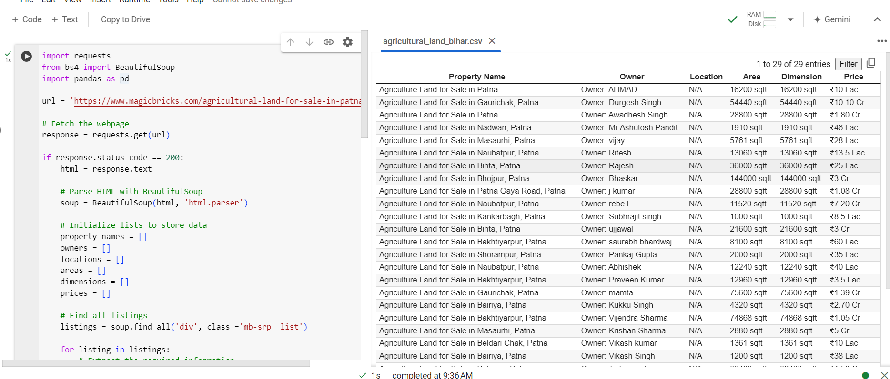

# Agricultural Land Listings Scraper

This project scrapes agricultural land listings from MagicBricks for properties in Patna. It extracts details such as property name, owner, location, area, dimensions, and price, and saves the data into a CSV file.

## Features

- Scrapes agricultural land listings from MagicBricks.
- Extracts relevant details about each property.
- Saves the data into a CSV file for easy analysis.

## Screenshots





## Installation

1. Clone the repository:

    ```bash
    git clone https://github.com/your-username/agricultural-land-scraper.git
    cd agricultural-land-scraper
    ```

2. Create a virtual environment and activate it:

    ```bash
    python -m venv venv
    source venv/bin/activate  # On Windows use `venv\Scripts\activate`
    ```

3. Install the required packages:

    ```bash
    pip install -r requirements.txt
    ```

4. Run the script:

    ```bash
    python scraper.py
    ```

## Usage

- The script will fetch the webpage, parse the HTML, and extract the relevant data.
- The data will be saved into a CSV file named `agricultural_land_bihar.csv`.

## Code Explanation

The script performs the following steps:

1. **Fetch the webpage**: The script sends a request to the URL and fetches the HTML content.
2. **Parse HTML**: It uses BeautifulSoup to parse the HTML content.
3. **Extract Data**: The script finds all property listings and extracts details such as property name, owner, location, area, dimensions, and price.
4. **Save Data**: The extracted data is saved into a CSV file using pandas.

## Requirements

- `requests`
- `beautifulsoup4`
- `pandas`

You can install the required packages using:

```bash
pip install requests beautifulsoup4 pandas
